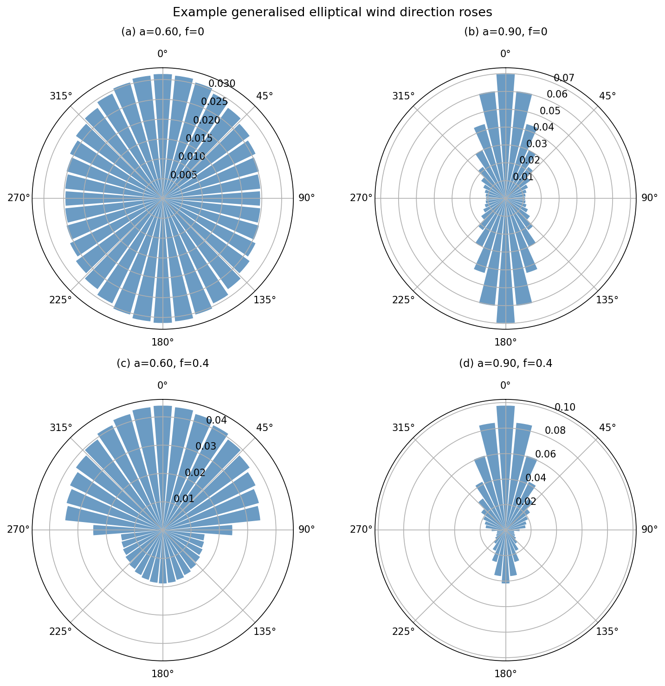
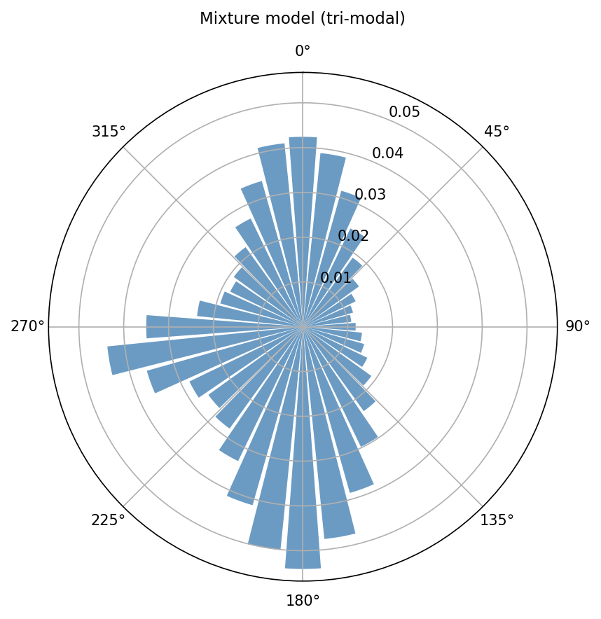

# edrose

A Python implementation of the elliptical wind direction rose model from [Hart (2025)](https://doi.org/10.5194/wes-10-1821-2025).

The model parameterises a wind direction rose using ellipse geometry with just three parameters:

| Parameter | Description |
|-----------|-------------|
| `a` | Ellipse shape. `a = 1/sqrt(pi) ≈ 0.564` gives a uniform (circular) distribution. Larger values concentrate probability along the prevailing axis. |
| `f` | Folding parameter in [0, 1]. `f = 0` gives a symmetric (bi-directional) rose; `f > 0` shifts probability toward the prevailing direction. |
| `theta_prev` | Prevailing wind direction in degrees. |

## Installation

```bash
pip install -e .
```

## Quick start

```python
from edrose import EllipticalWindRose

# Create a wind rose from parameters
wr = EllipticalWindRose(a=0.8, f=0.3, theta_prev=210, n_sectors=12)

# Sector frequencies and directions
print(wr.wind_directions)       # [0, 30, 60, ..., 330]
print(wr.sector_frequencies)    # array of 12 probabilities summing to 1
```

## Fitting to measured data

```python
import numpy as np
from edrose import EllipticalWindRose

# Measured sector frequencies (e.g. from a met mast)
measured = np.array([0.08, 0.06, 0.04, 0.03, 0.04, 0.06,
                     0.10, 0.14, 0.16, 0.14, 0.10, 0.05])

wr = EllipticalWindRose.fit(measured)
print(wr)          # EllipticalWindRose(a=..., f=..., theta_prev=..., n_sectors=12)
print(wr.r_squared, wr.rmse)
```

## PyWake integration

The API is designed to be compatible with [PyWake](https://topfarm.pages.windenergy.dtu.dk/PyWake/). Sector frequencies can be used directly, and Weibull A/k parameters are passed through:

```python
from edrose import EllipticalWindRose

wr = EllipticalWindRose(a=0.8, f=0.3, theta_prev=210, n_sectors=12)

# Get arrays for manual use
arrays = wr.pywake_arrays(A=9.0, k=2.0)
# arrays['wd'], arrays['freq'], arrays['A'], arrays['k']

# Or create an XRSite directly (requires py_wake installed)
site = wr.to_pywake_site(A=9.0, k=2.0, ti=0.05)
```

Per-sector Weibull parameters are also supported:

```python
A_per_sector = [8.5, 9.0, 9.5, 10.0, 9.5, 9.0, 8.5, 8.0, 7.5, 8.0, 8.5, 9.0]
k_per_sector = [2.0, 2.1, 2.2, 2.3, 2.2, 2.1, 2.0, 1.9, 1.8, 1.9, 2.0, 2.1]
site = wr.to_pywake_site(A=A_per_sector, k=k_per_sector)
```

## Mixture models

Multi-modal direction distributions can be represented by combining multiple elliptical roses (see Hart 2025, Fig. 4):

```python
from edrose import EllipticalWindRose, MixtureEllipticalWindRose

c1 = EllipticalWindRose(a=0.8, f=0.1, theta_prev=180, n_sectors=36)
c2 = EllipticalWindRose(a=1.1, f=1.0, theta_prev=260.5, n_sectors=36)
mix = MixtureEllipticalWindRose([c1, c2], weights=[0.85, 0.15])

print(mix.sector_frequencies.sum())  # 1.0
```

## Example wind roses (Figure 2 from the paper)

The four panels below show the effect of the shape parameter `a` and folding parameter `f`:



- **(a)** `a=0.60, f=0` -- Nearly uniform, slight N-S elongation
- **(b)** `a=0.90, f=0` -- Stronger bi-directional concentration along N-S
- **(c)** `a=0.60, f=0.4` -- Mild folding toward the prevailing direction (N)
- **(d)** `a=0.90, f=0.4` -- Strong uni-directional concentration toward N

## Mixture model (Figure 4 from the paper)

A tri-modal distribution built from two components:



Component 1: `(a=0.8, f=0.1, theta_prev=180)`, weight 0.85
Component 2: `(a=1.1, f=1.0, theta_prev=260.5)`, weight 0.15

## Plotting

```python
wr = EllipticalWindRose(a=0.9, f=0.3, theta_prev=180, n_sectors=36)
wr.plot()

# Overlay measured data
wr.plot(measured_freq=measured)
```

## Reference

Hart, E. (2025). Brief communication: An elliptical parameterisation of the wind direction rose. *Wind Energy Science*, 10, 1821--1827. [https://doi.org/10.5194/wes-10-1821-2025](https://doi.org/10.5194/wes-10-1821-2025)
